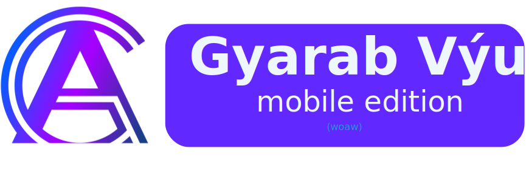
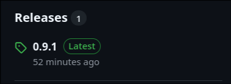

    

## Gyarab Výuka Android

---
GAV Android je mobilní aplikacce pro rychlý
a jednoduchý přístup k datům z webového serveru https://vyuka.gyarab.cz.

## Funkce

GAV Android je ten stejný server vyuka.gyarab.cz, co všichni tolerujeme. Aplikace má k prakticky
celému serveru read-only přístup nyní s:
- lepší UI
- responzivnější aplikací
- quality-of-life funkce (auto-update, notifikace pro úkoly z programování (coming soon!))
- mnohem víc!

## Instalace

### I ain't readin' allat brochacho 

[Rychlý odkaz na stažení poslední verze](https://github.com/CodyMarkix/GAVClient/releases/download/latest/gav-release.apk)

### Github vydání

Nejjednodušší způsob jak aplikaci nainstalovat je stáhnout ji přes Github releases.

Aplikace je schopná sama detekovat nové verze, přičemž vás notifikuje na příštím spuštění aplikace.

### Obtanium

Ti, kteří si aplikace spravujou přes Obtanium, si můžou dělat jak se jim zalíbí.
Pokud aplikace detekuje instalaci Obtania, automaticky zablokuje svůj auto-update mechanismus.